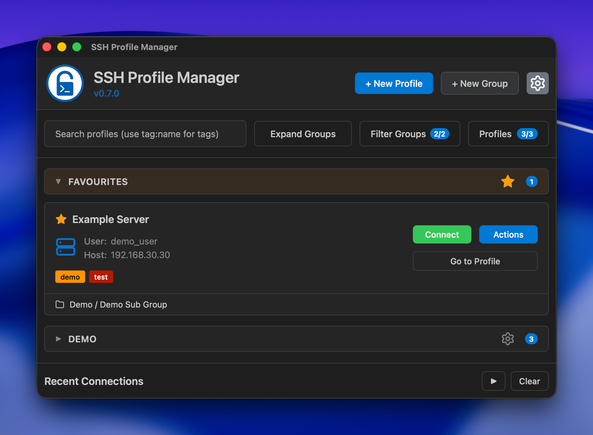
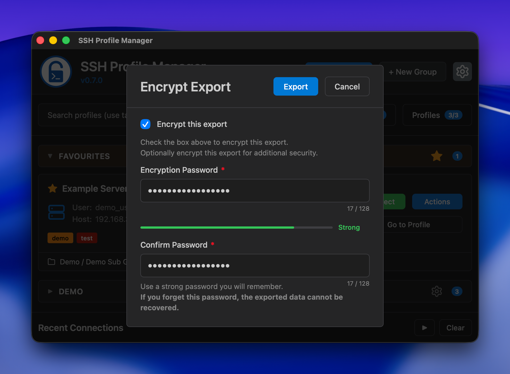
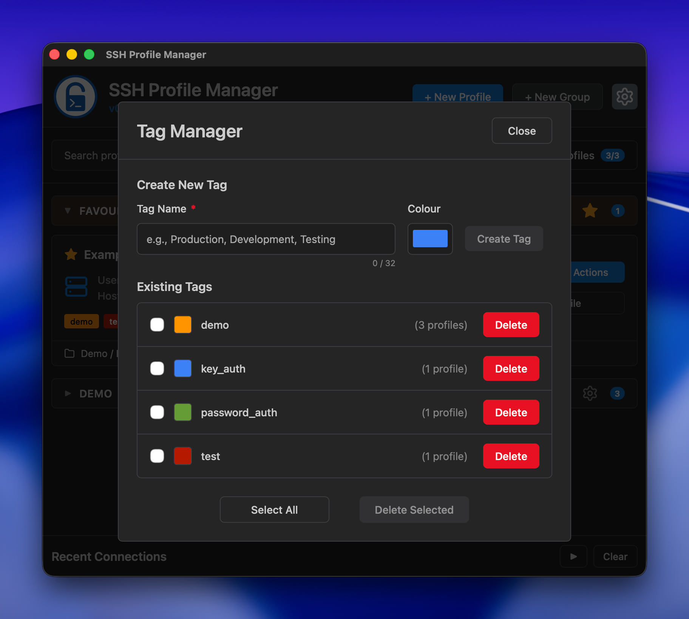
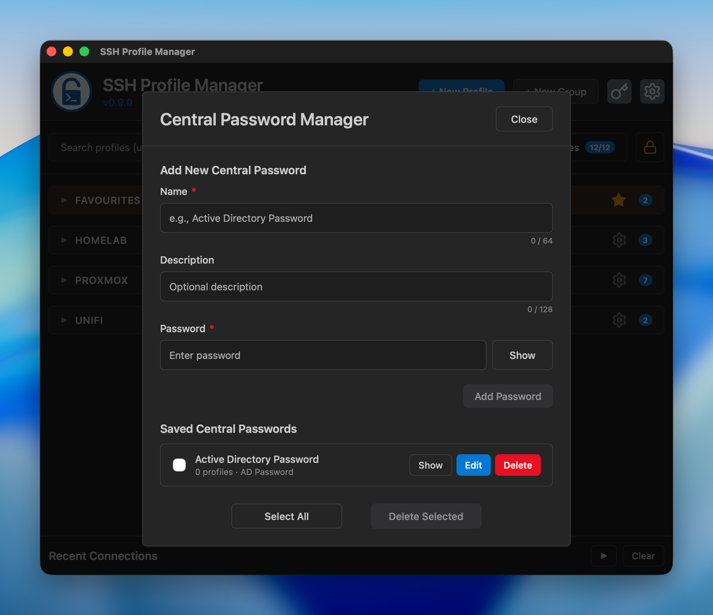

<div align="center">


# SSH Profile Manager

**A lightweight, native SSH profile manager built with Tauri and Rust**

[](https://github.com/tomsinclair94/ssh-profile-manager/releases)
[](https://github.com/tomsinclair94/ssh-profile-manager/releases)
[](https://www.rust-lang.org/)
[](https://tauri.app/)
[](LICENSE)
[](https://github.com/tomsinclair94/ssh-profile-manager/releases)

[](https://github.com/tomsinclair94/ssh-profile-manager/releases/latest)

<sub>**macOS 14.0+ | Windows 11+ | Native Performance**</sub>

<sub>⚠️ **macOS Gatekeeper Warning** ⚠️</sub>

<sub>Right-click and select "Open" on first launch to bypass Gatekeeper (unsigned app)</sub>

<sub>Alternatively, run: `xattr -cr "/Applications/SSH Profile Manager.app"`</sub>

</div>

---

## Why SSH Profile Manager?

Manage SSH connection profiles with a clean GUI and launch them in your native terminal. No more memorising commands, endpoints or credentials!

🚀 **Native Performance** (Tauri + Rust) • 🔒 **Secure** (system keychain / local SSH Keys) • 🎯 **Simple** (clean, focused UI)

## Features

**Profile Management**
- ✅ Create, edit, delete, and duplicate profiles
- 📂 Organise with hierarchical groups and sub-groups (up to 3 levels deep)
- 🔀 Move profiles and groups — reorganise without deleting and recreating
- ↕️ Custom sort order — drag to reorder profiles and groups; persists across restarts
- ⭐ Favourites — star profiles for instant access from the top of the list
- 🎨 Profile icons — choose from 40+ icons for visual recognition
- 🏷️ Tags — colour-coded labels with `tag:name` search filtering
- 🔑 SSH Key, Password (keychain), Central Password (shared credential), or Keyboard-Interactive auth
- 🗝️ Central Passwords — shared credentials across multiple profiles; rotate once, all profiles update

**Export & Import**
- 📤 Export/import individual profiles or entire group trees
- 🔐 Encrypted exports with AES-256-GCM and PBKDF2 key derivation
- 🔁 Duplicate detection with skip, rename, or overwrite options
- 💾 Backup & restore all settings and profiles

**SSH Connections**
- ⚡ Connect via native terminal or embedded terminal (xterm.js)
- 🕒 Recent connections bar for quick reconnection
- 📊 Real-time connection status tracking

**Keyboard Navigation**
- ⌨️ 30+ keyboard shortcuts — press `?` to view all shortcuts
- Tab, arrow keys, and quick actions throughout

**Modern UI**
- 🌓 Dark/Light themes with system sync
- 📱 Responsive layout with smooth animations
- 🔄 Reset to defaults • Auto-update checker

## Screenshots

<div align="center">

### Main Interface


*Hierarchical groups, search, tag filtering, favourites, and recent connections bar*

### Favourites


*Star any profile to pin it to the Favourites group at the top of the list*

### Encrypted Export


*Export profiles and groups with AES-256-GCM encryption and a password strength metre*

### Tag Manager


*Colour-coded tags with multi-select management and tag:name search filtering*

### Central Password Manager


*Shared credentials linked to multiple profiles — change a password once and all linked profiles update immediately*

### Keyboard Shortcuts Help


*Press ? to view all 30+ available keyboard shortcuts*

### Embedded Terminal


*Full terminal emulation with xterm.js and real-time connection status*

### Settings Modal


*Dark/Light theme, keyboard shortcuts toggle, backup/restore and more*

### Profile Editor


*Create and edit profiles with icon picker, auth method selection, and validation*

</div>

## Installation

**macOS**
1. Download the latest `.dmg` from [Releases](https://github.com/tomsinclair94/ssh-profile-manager/releases)
2. Drag "SSH Profile Manager" to Applications
3. **First launch:** Right-click → "Open" to bypass Gatekeeper (unsigned app), or run `xattr -cr "/Applications/SSH Profile Manager.app"` from Terminal

**Windows**
1. Download the latest `.msi` from [Releases](https://github.com/tomsinclair94/ssh-profile-manager/releases)
2. Run the installer
3. Launch from Start Menu

## Quick Start

**Create a Profile:** Click "New Profile" → Fill in Name, Host, Username → Choose auth method → Pick an icon → Save

**Connect:** Click the green "Connect" button → Terminal opens automatically → App minimises

**Organise:** Create groups and sub-groups → Star profiles as Favourites → Add colour-coded tags → Use search & filters

**Backup:** Settings → Backup/Restore → Toggle "Include Profiles" → Export (optionally encrypted) → Restore anytime

## Keyboard Shortcuts

SSH Profile Manager supports comprehensive keyboard navigation throughout the app. Press **?** in the app to view all available shortcuts. Can be disabled in Settings if preferred.

## Recent Connections & Embedded Terminal

**Recent Connections:** Your last 5 connections appear below the profile list for quick reconnection. Click to reconnect, or manage via keyboard shortcuts.

**Embedded Terminal:** Connect using the built-in terminal emulator (xterm.js) with real-time connection status. Choose between native terminal or embedded terminal from the Connect dropdown.

## Development

### Prerequisites
- [Bun](https://bun.sh/) (latest)
- [Rust](https://www.rust-lang.org/tools/install)
- **macOS:** Xcode Command Line Tools
- **Windows:** Microsoft C++ Build Tools

### Setup
```bash
# Clone the repository
git clone https://github.com/tomsinclair94/ssh-profile-manager.git
cd ssh-profile-manager

# Install dependencies
bun install

# Run in development mode
bun run dev
```

### Building
```bash
# Build for production
bun run build

# Output locations:
# macOS: src-tauri/target/release/bundle/macos/
# Windows: src-tauri/target/release/bundle/msi/
```

## Tech Stack

- **Frontend:** Vanilla HTML/CSS/JavaScript (no framework bloat)
- **Backend:** Rust with Tauri v2
- **Database:** SQLite (rusqlite)
- **Secure Storage:** System keychain (keyring crate)
- **Build Tool:** Tauri CLI

## Project Structure

```
ssh-profile-manager/
├── dist/              # Frontend files (HTML, CSS, JS)
│   └── vendor/        # Vendored libraries (xterm.js)
├── src-tauri/         # Rust backend
│   ├── src/
│   │   ├── lib.rs     # Main backend code
│   │   └── tests/     # Test modules (163 tests)
│   ├── icons/         # App icons
│   └── Cargo.toml     # Rust dependencies
├── plans/             # Development plans and test artefacts
├── screenshots/       # App screenshots
├── package.json       # Node dependencies
├── CHANGELOG.md       # Version history
└── SECURITY.md        # Security policy
```

## Data Storage

- **Profiles:** SQLite database in application data directory
  - macOS: `~/Library/Application Support/ssh-profile-manager/profiles.db`
  - Windows: `%LOCALAPPDATA%\ssh-profile-manager\profiles.db`
- **Passwords:** Stored securely in system keychain/credential manager

## Platform Support

- ✅ macOS 14.0+ (Apple Silicon / ARM64)
- ✅ Windows 11+

## License

GPL-3.0 License - See [LICENSE](LICENSE) file for details

## Acknowledgements

Built with [Tauri](https://tauri.app/) - a framework for building tiny, fast binaries for all major platforms.

---

<div align="center">

**Author:** Tom Sinclair
**AI Assistant:** Claude (Anthropic)

[Report Issues](https://github.com/tomsinclair94/ssh-profile-manager/issues) • [View Releases](https://github.com/tomsinclair94/ssh-profile-manager/releases)

</div>
