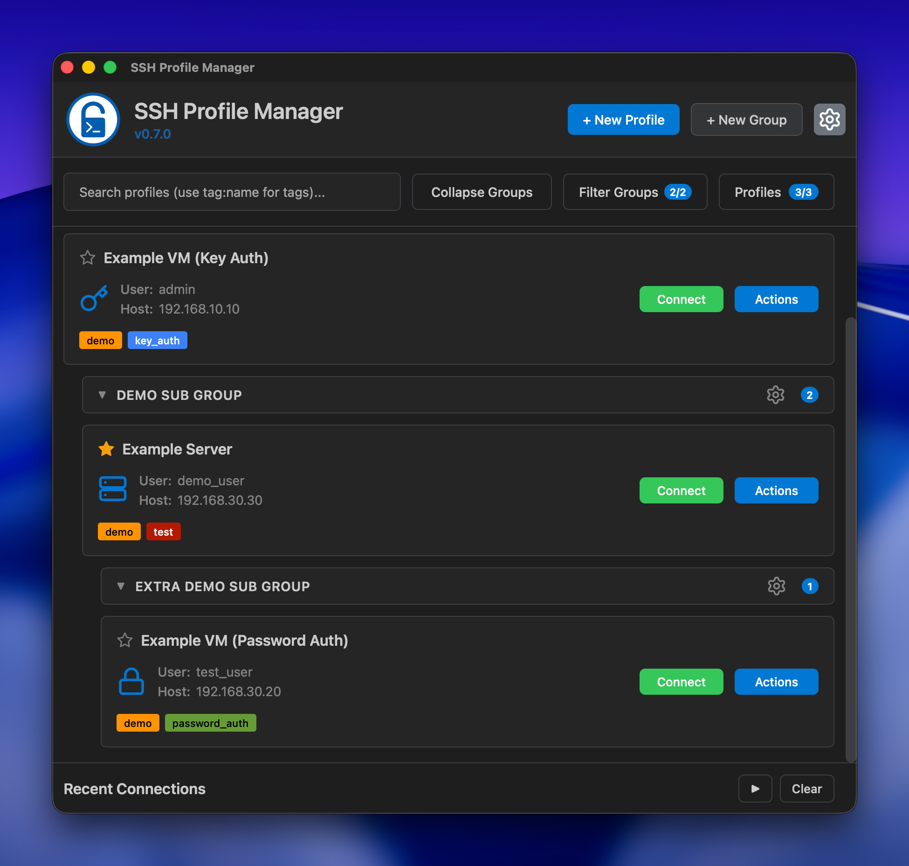
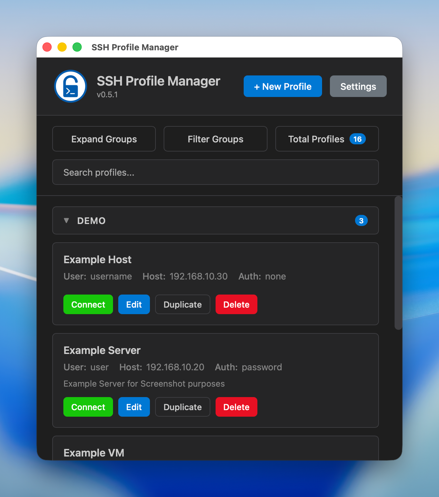
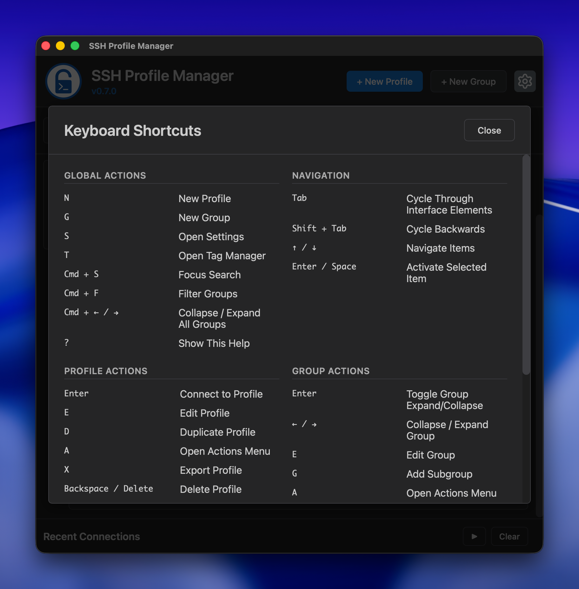
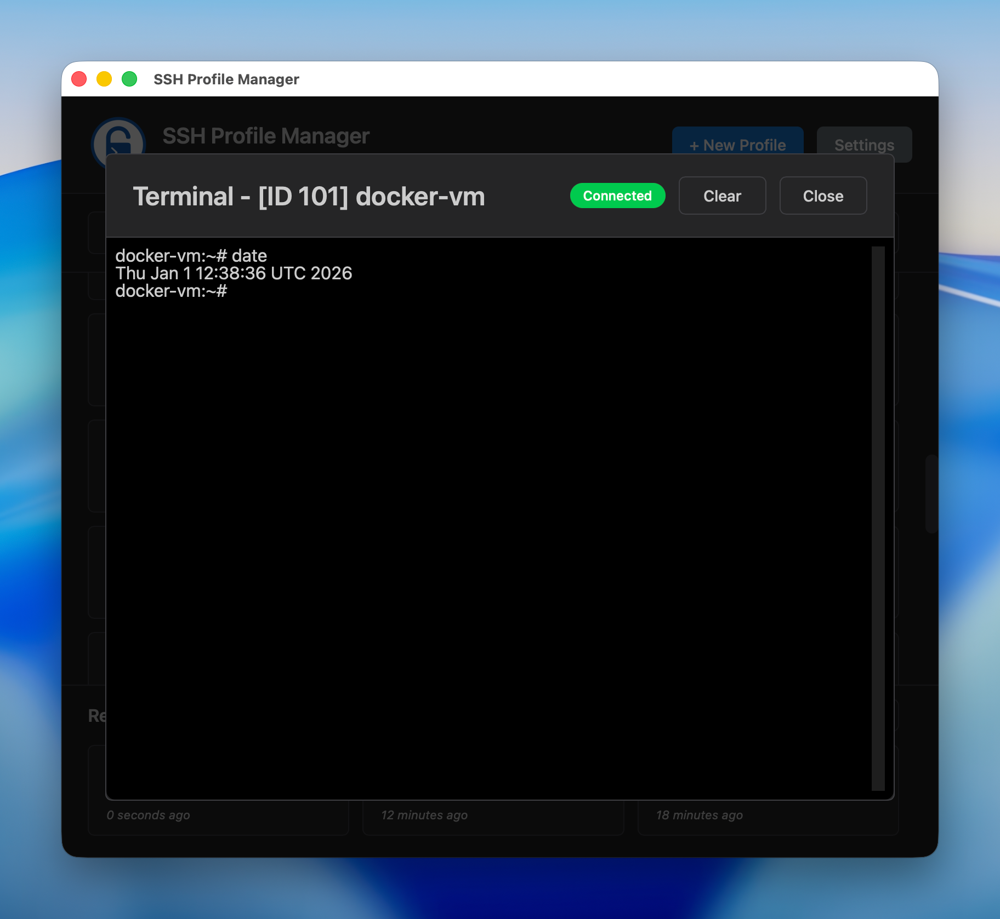
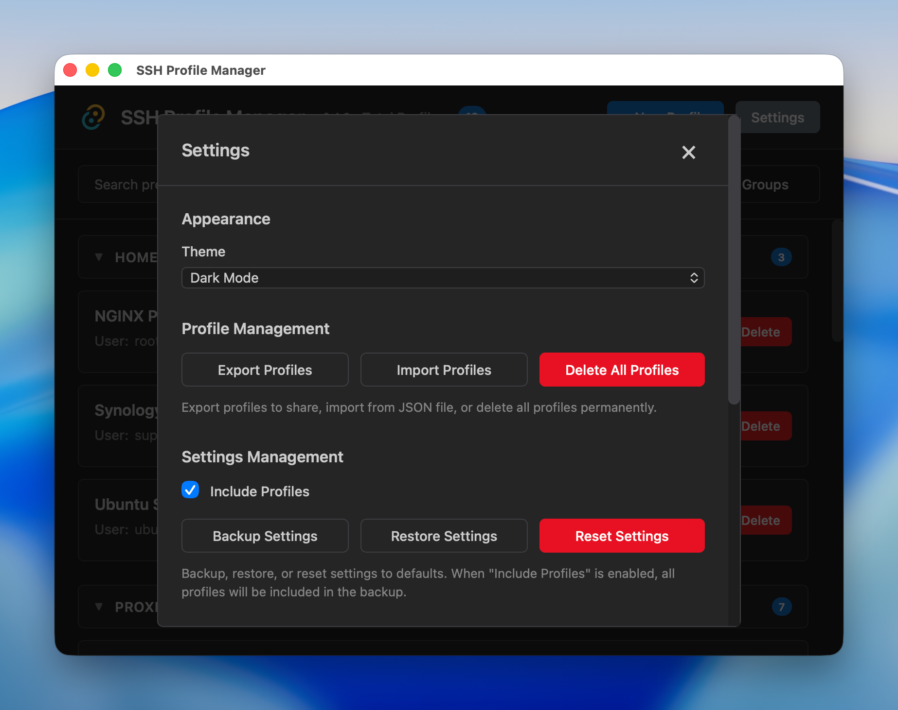
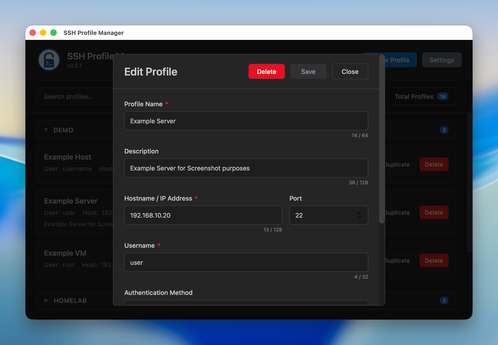

<div align="center">


# SSH Profile Manager

**A lightweight, native SSH profile manager built with Tauri and Rust**

[](https://github.com/tomsinclair94/ssh-profile-manager/releases)
[](https://github.com/tomsinclair94/ssh-profile-manager/releases)
[](https://www.rust-lang.org/)
[](https://tauri.app/)
[](LICENSE)
[](https://github.com/tomsinclair94/ssh-profile-manager/releases)

[](https://github.com/tomsinclair94/ssh-profile-manager/releases/latest)

<sub>**macOS 14.0+ | Windows 10+ | Native Performance**</sub>

<sub>⚠️ **macOS Gatekeeper Warning** ⚠️</sub>

<sub>Right-click and select "Open" on first launch to bypass Gatekeeper (unsigned app)</sub>

<sub>Alternatively, run: `xattr -cr "/Applications/SSH Profile Manager.app"`</sub>

</div>

---

## Why SSH Profile Manager?

Manage SSH connection profiles with a clean GUI and launch them in your native terminal. No more memorising commands, endpoints or credentials!

🚀 **Native Performance** (Tauri + Rust) • 🔒 **Secure** (system keychain / local SSH Keys) • 🎯 **Simple** (clean, focused UI)

## Features

**Profile Management**
- ✅ Create, edit, delete, and duplicate profiles
- 📁 Organise with collapsible groups, search & filtering
- 🔑 SSH Key, Password (keychain), or Keyboard-Interactive auth
- 📤 Export/Import for team sharing

**SSH Connections**
- ⚡ Connect via native terminal or embedded terminal (xterm.js)
- 🕒 Recent connections bar for quick reconnection
- 📊 Real-time connection status tracking

**Keyboard Navigation**
- ⌨️ Full keyboard shortcuts (press ? to view)
- Tab, arrow keys, and quick actions throughout

**Modern UI**
- 🌓 Dark/Light themes with system sync
- 📱 Responsive layout with smooth animations

**Settings & Backup**
- 💾 Backup & restore settings and profiles
- 🔄 Reset to defaults • Auto-update checker

## Screenshots

<div align="center">

### Main Interface


*Profile list with collapsible groups, search, filtering, and recent connections bar*

### Main Interface (Compact View)


*Responsive layout when window is narrower - search moves to separate row for a more compact look*

### Keyboard Shortcuts Help


*Press ? to view all available keyboard shortcuts*

### Embedded Terminal


*Full terminal emulation with xterm.js and real-time connection status*

### Settings Modal


*Dark/Light theme, keyboard shortcuts toggle, backup/restore and more*

### Profile Editor


*Create and modify profiles with validation and tooltips*

</div>

## Installation

**macOS**
1. Download the latest `.dmg` from [Releases](https://github.com/tomsinclair94/ssh-profile-manager/releases)
2. Drag "SSH Profile Manager" to Applications
3. **First launch:** Right-click → "Open" to bypass Gatekeeper (unsigned app), or run `xattr -cr "/Applications/SSH Profile Manager.app"` from Terminal

**Windows**
1. Download the latest `.msi` from [Releases](https://github.com/tomsinclair94/ssh-profile-manager/releases)
2. Run the installer
3. Launch from Start Menu

## Quick Start

**Create a Profile:** Click "New Profile" → Fill in Name, Host, Username → Choose auth method → Save

**Connect:** Click the green "Connect" button → Terminal opens automatically → App minimises

**Organise:** Group profiles → Collapse/expand groups → Use search & filters

**Backup:** Settings → Backup Settings → Toggle "Include Profiles" for full backup → Export → Restore anytime

## Keyboard Shortcuts

SSH Profile Manager supports comprehensive keyboard navigation throughout the app. Press **?** in the app to view all available shortcuts. Can be disabled in Settings if preferred.

## Recent Connections & Embedded Terminal

**Recent Connections:** Your last 5 connections appear below the profile list for quick reconnection. Click to reconnect, or manage via keyboard shortcuts.

**Embedded Terminal:** Connect using the built-in terminal emulator (xterm.js) with real-time connection status. Choose between native terminal or embedded terminal from the Connect dropdown.

## Development

### Prerequisites
- [Node.js](https://nodejs.org/) (v16+)
- [Rust](https://www.rust-lang.org/tools/install)
- **macOS:** Xcode Command Line Tools
- **Windows:** Microsoft C++ Build Tools

### Setup
```bash
# Clone the repository
git clone https://github.com/tomsinclair94/ssh-profile-manager.git
cd ssh-profile-manager

# Install dependencies
npm install

# Run in development mode
npm run dev
```

### Building
```bash
# Build for production
npm run build

# Output locations:
# macOS: src-tauri/target/release/bundle/macos/
# Windows: src-tauri/target/release/bundle/msi/
```

## Tech Stack

- **Frontend:** Vanilla HTML/CSS/JavaScript (no framework bloat)
- **Backend:** Rust with Tauri v2
- **Database:** SQLite (rusqlite)
- **Secure Storage:** System keychain (keyring crate)
- **Build Tool:** Tauri CLI

## Project Structure

```
ssh-profile-manager/
├── dist/              # Frontend files (HTML, CSS, JS)
├── src-tauri/         # Rust backend
│   ├── src/           # Rust source code
│   ├── icons/         # App icons
│   └── Cargo.toml     # Rust dependencies
├── package.json       # Node dependencies
└── README.md          # This file
```

## Data Storage

- **Profiles:** SQLite database in application data directory
  - macOS: `~/Library/Application Support/ssh-profile-manager/profiles.db`
  - Windows: `%APPDATA%\ssh-profile-manager\profiles.db`
- **Passwords:** Stored securely in system keychain/credential manager

## Platform Support

- ✅ macOS 14.0+ (Apple Silicon / ARM64)
- ✅ Windows 10+

## License

GPL-3.0 License - See [LICENSE](LICENSE) file for details

## Acknowledgements

Built with [Tauri](https://tauri.app/) - a framework for building tiny, fast binaries for all major platforms.

---

<div align="center">

**Author:** Tom Sinclair
**AI Assistant:** Claude (Anthropic)

[Report Issues](https://github.com/tomsinclair94/ssh-profile-manager/issues) • [View Releases](https://github.com/tomsinclair94/ssh-profile-manager/releases)

</div>
